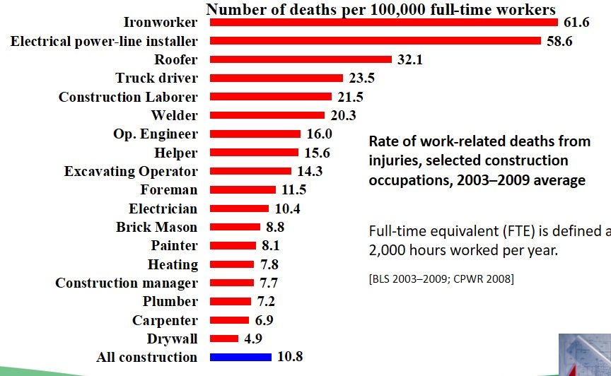
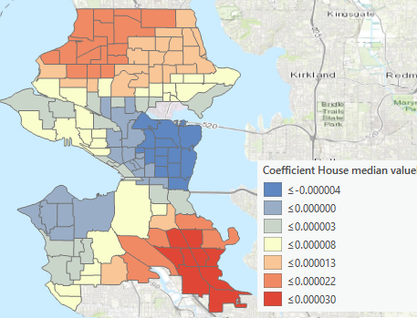
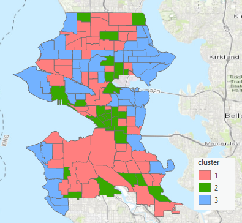

## Energy code

### Title 24 vs. IECC
연방정부 기준인 IECC 를 적어도 만족시키는 주정부 energy 기준이 있어야 하는데, CA 의 경우 2016 Building Energy Efficiency Standards Title 24, Part 6 이 2015 IECC 를 넘어서는 결과를 보여주고 있다. 

### 2018 IECC 
가장 최근 버전으로 - APPENDIX RA SOLAR-READY PROVISIONS—DETACHED ONE- AND TWOFAMILY DWELLINGS, MULTIPLE SINGLE-FAMILY DWELLINGS (TOWNHOUSES) - solar ready 에 대한 조건이 있다. 

### 2019 Residential Compliance Manual 
CA 에서 나온 것으로, PV 설치를 강제하고 있고, 예외에 한에서 역시 solar ready 를 강제하고 있다. Seattle 이 경우 2017 residential code 가 해당. Residential 의 경우 solar ready 는 residential code 에 있는데, commercial 의 경우 solar ready 는 building code 가 아닌 energy code 에 있다. 참고로, single family 와 low rise multifamily 는 residential code (특별 building code 로 보면 될 듯), 그 외는 building code. 그리고 solar 를 직접 설치 했을 때는 NEC 의 electrical code 와 관계한 electrical permit 을 받아야 한다. 

> The California Energy Code, part 6 of the California Building Standards Code which is title 24 of the California Code of Regulations, also titled The Energy Efficiency Standards for Residential and Nonresidential Buildings, were created by the California Building Standards Commission in 1978 in response to a legislative mandate to reduce California's energy consumption. The standards are updated periodically by the California Energy Commission to allow consideration and possible incorporation of new energy efficiency technologies and methods. The California Energy Code (CEC) contains energy conservation standards applicable to most residential and nonresidential buildings throughout California, including schools. - solar ready, residential compliance manual.

> There are 3 different kinds of building codes: private sector, federal sector, and international. The private sector codes are associated with state and local jurisdiction. States and local jurisdictions have different energy codes that they follow based on climate, geography, and many other contributing factors. The two primary baseline codes for the private sector are the International Energy Conservation Code (IECC), and the ANSI/ASHRAE/IESNA Standard 90.1 energy standard for Buildings Except Low-Rise Residential Buildings (ASHRAE 90.1).[4] States and local governments adopt and enforce these energy codes. The standards are published by national organizations such as ASHRAE. The International Code Council (ICC) develops the codes and standards used to construct residential and commercial buildings, including homes and schools.[5] Within the ICC is the IECC which is a subset of the ICC. The IECC is a model energy code, but it is written in mandatory, enforceable language, so that state and local jurisdictions can easily adopt the model as their energy code.[6] The IECC references several ASHRAE Standards, in particular the ASHRAE 90.1 for commercial building construction.

## OSHA

* Roof slope: OSHA defines a low-slope roof as a roof having a slope of less than or equal to 4 inches of vertical rise for every 12 inches horizontal length (4:12) (1926.500(b)—definitions). This is important because the OSHA definition is used as a basis for implementing low-slope fall-protection measures, such as warningline
systems and safety monitors.

* Ladder: angle 75 degree, one-quarter the working length of the ladder (a 1:4 ratio) (29 CFR 1926.1053(b)(5)(i)). 3 rungs (1 ft apart) above the roof, The side rails of the ladder generally must extend at least 3 feet above the upper landing surface that the worker is trying to access (29 CFR 1926.1053(b)(1)).

* Anchor: OSHA standard regarding anchorages can be found in 29 CFR 1926.502(d)(15)

## Risk per full-time workers 


## Ideal design for safety from the interviews 
* Roof pitch: lower than 5/12 – 7/12 to work easy, fall
* Roof material: composition not to be slippery, fall
* Roof structure: no obstruction no to be interrupted, trip, complexity
* Roof condition: accessories pre-installed to reduce the scope, complexity
* Anchor point: pre-installed to be efficient, fall
* Access: low height, enough space for easier access, fall
* Additional: setback, snow guard, guardrail to prevent fall
* Electrical: micro inverter, conduit pre-run, reserving spaces, electric shock, complexity


## Solar installation trend in Seattle


## Solar installation trend by contractors 


## Cumulative solar installation per census track


## Residential household in Seattle


## Residential solar potential (MWh) in Seattle


## Residential solar potential (MWh/ household) in Seattle


## Histograms of multiple variables 


## Boxplot for overall potential solar


## Cor plot


## Regression


```
## 
## Call:
## lm(formula = sol_instl ~ hu_med_val + hu_ex_1000, data = regr[-c(1)])
## 
## Residuals:
##     Min      1Q  Median      3Q     Max 
## -8.4964 -1.8188 -0.4623  1.1230 16.2559 
## 
## Coefficients:
##               Estimate Std. Error t value Pr(>|t|)    
## (Intercept) -1.984e+00  8.119e-01  -2.444   0.0159 *  
## hu_med_val   3.905e-06  1.954e-06   1.998   0.0478 *  
## hu_ex_1000   1.768e+01  1.594e+00  11.094   <2e-16 ***
## ---
## Signif. codes:  0 '***' 0.001 '**' 0.01 '*' 0.05 '.' 0.1 ' ' 1
## 
## Residual standard error: 2.875 on 128 degrees of freedom
## Multiple R-squared:  0.6136,	Adjusted R-squared:  0.6076 
## F-statistic: 101.6 on 2 and 128 DF,  p-value: < 2.2e-16
```

## Residual from the OLS 
<center>

{width=450px}

</center>

## Geographically weighted regression (GWR)
<center>

{width=450px}

</center>

## Geographically weighted impact 
<center>

{width=450px}

</center>

<center>

{width=450px}

</center>

<center>

{width=450px}

</center>

<center>

{width=450px}

</center>


## Factor analysis (Parallel screen) 


```
## Parallel analysis suggests that the number of factors =  3  and the number of components =  NA
```

## Factor analysis (Plot)


## Factor analysis (Diagram)


## Factor correlation for solar installation


```
## [1] 131   3
```


## Factor regression 

```
## 
## Call:
## lm(formula = regr[[14]] ~ dat[, 1] + dat[, 2] + dat[, 3])
## 
## Residuals:
##     Min      1Q  Median      3Q     Max 
## -8.4394 -1.6916 -0.5028  1.0860 16.2534 
## 
## Coefficients:
##             Estimate Std. Error t value Pr(>|t|)    
## (Intercept)   5.0904     0.2531  20.112   <2e-16 ***
## dat[, 1]      3.3447     0.3443   9.715   <2e-16 ***
## dat[, 2]      0.6351     0.3127   2.031   0.0443 *  
## dat[, 3]      0.3905     0.3147   1.241   0.2169    
## ---
## Signif. codes:  0 '***' 0.001 '**' 0.01 '*' 0.05 '.' 0.1 ' ' 1
## 
## Residual standard error: 2.897 on 127 degrees of freedom
## Multiple R-squared:  0.6106,	Adjusted R-squared:  0.6014 
## F-statistic: 66.39 on 3 and 127 DF,  p-value: < 2.2e-16
```

## Cluster analysis

```
## 
##  1  2  3 
## 55 32 44
```


## Cluster within cluster sum of squares (WCSS)


```
## [1] 177.3648
```


## Optimal cluster 


## Cluster plot


## 3D plot


## Cluster with boxplot


## Cluster plot with smooth


## Data analysis 1


## Data analysis 2


## Data analysis 3


<center>

{width=450px}

</center>
